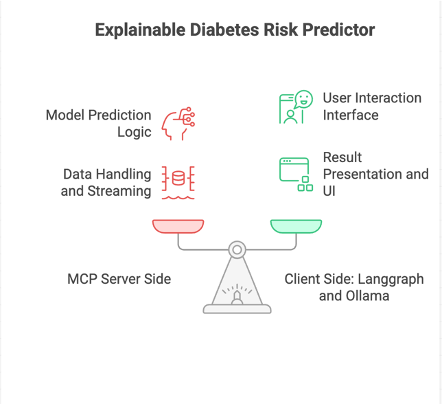
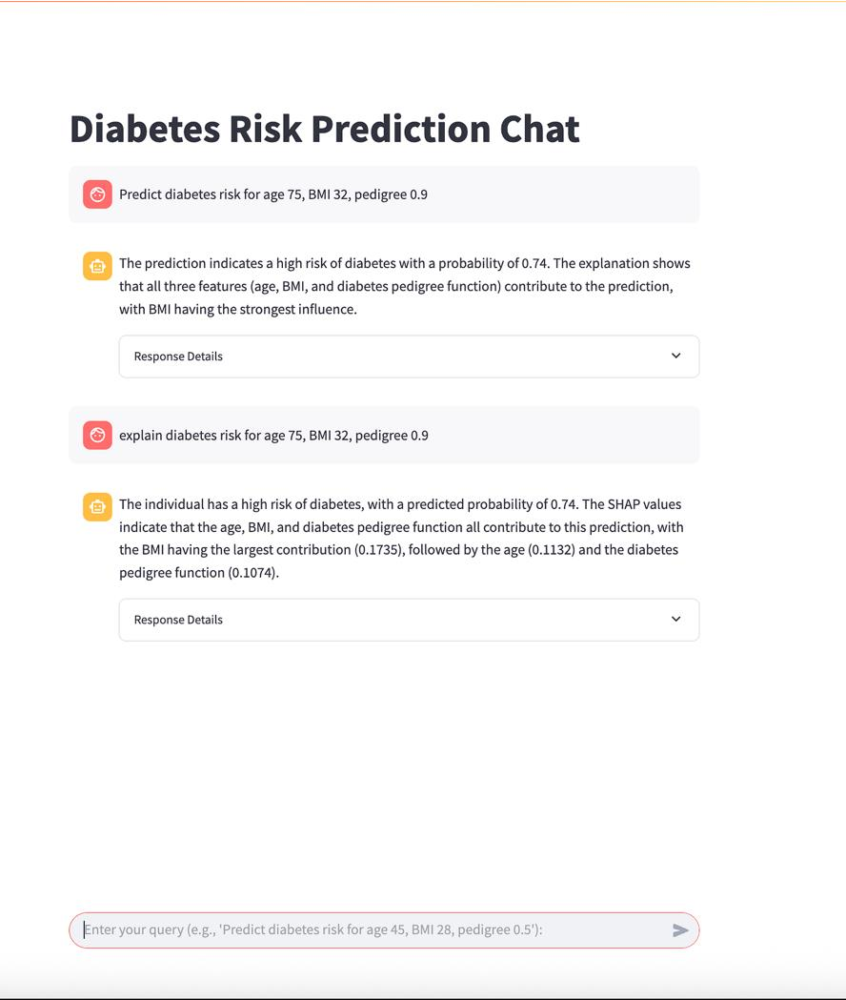
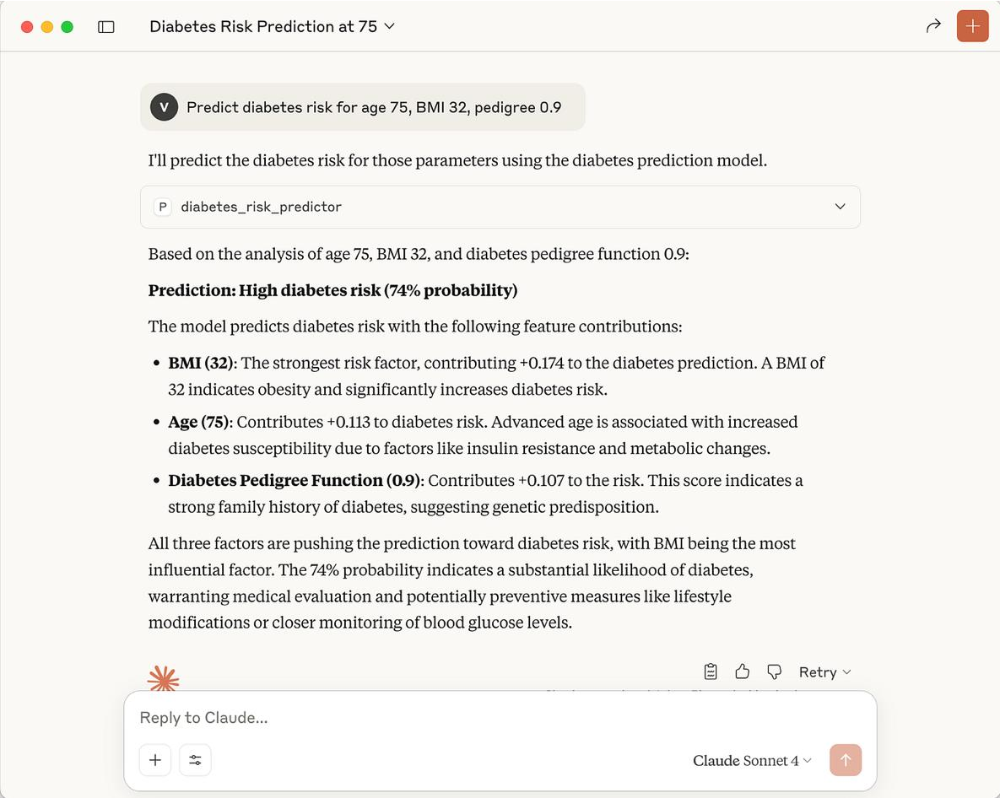

**ExplainableAI** **inAction:** **Health** **Risk** **Prediction**
**with** **LangGraph,** **MCP,** **and**
**SHAP.**

Step-by-Step Guide: Turn a Scikit-learn Model into a Fully Explainable
AI Chatbot Using MCP, SHAP, and LangGraph Agents in Streamlit.

[<u>Vikram
Bhat</u>](https://medium.com/@vikrambhat2?source=post_page---byline--ceeb02a7b6b3---------------------------------------)

**1.** **Introduction**

In modern AI systems, **machine** **learning** **models** **alone**
**aren’t** **enough**. You also need ways to:

> • Use them as callable tools from LLMs or agents • Compose them with
> reasoning logic

• Make them explainable, testable, and controllable This is where
**MCP** **(Model** **Context** **Protocol)** becomes critical.

MCP isn’t just an interface — it’s a **protocol** **that** **turns**
**any** **ML** **model** **or** **function** **into** **a**
**structured,** **LLM-callable** **tool**, complete with metadata,
streaming, logging, and reasoning support.

In this project, I demonstrate how to:

> • Wrap a scikit-learn diabetes risk prediction model as an MCP tool —
> exposing both prediction and SHAP-based explanation functionality
>
> • Serve it using the latest FastMCP server, which supports multi-tool
> serving, strict I/O validation, and streaming responses
>
> • Query the tools via a LangGraph-powered ReAct agent backed by Ollama
> models like Qwen3:32b or Llama3.3
>
> • Interact with the full pipeline through a real-time Streamlit
> chatbot interface

MCP Server and Client: Generated using napkin.ai

[**End-to-End** **Guide** **to** **Building** **and** **Deploying**
**an** **MCP** **Server** **for** **AI**
**Toolchains**](https://pub.towardsai.net/end-to-end-guide-to-building-and-deploying-an-mcp-server-for-ai-toolchains-0d7beac8aaa9?source=post_page-----ceeb02a7b6b3---------------------------------------)
[Step-by-step guide to create, test, and deploy an MCP server using
Python and
FastMCP](https://pub.towardsai.net/end-to-end-guide-to-building-and-deploying-an-mcp-server-for-ai-toolchains-0d7beac8aaa9?source=post_page-----ceeb02a7b6b3---------------------------------------)
[pub.towardsai.net](https://pub.towardsai.net/end-to-end-guide-to-building-and-deploying-an-mcp-server-for-ai-toolchains-0d7beac8aaa9?source=post_page-----ceeb02a7b6b3---------------------------------------)

Follow along with the full code in my [<u>GitHub
repository.</u>](https://github.com/vikrambhat2/mcp-explainable-ml-pipeline)
**What’s** **different** **here?**

> • The ML model isn’t hardcoded or prompt-bound — it’s exposed as an
> **MCP** **tool** using FastMCP.
>
> • The server is powered by the **latest** **FastMCP**, a lightweight,
> standards-compliant tool server that supports **multi-tool**
> **serving**, **input/output** **validation**,
>
> and **structured** **streaming**.
>
> • The LangGraph agent doesn’t “guess” — it **calls** **the** **tool**
> using structured function calls, handles the response, and explains
> its reasoning.
>
> • The Streamlit UI talks to the MCP client, streams agent thoughts,
> and shows full traceability — making the ML pipeline **transparent**
> and **explainable**.

*By* *decoupling* *the* *model* *from* *the* *reasoning* *engine* *and*
*exposing* *it* *via* *MCP,* *this* *system* *achieves*
***modularity,*** ***explainability,*** ***and*** ***reusable***
***tooling*** *—* *key* *advantages* *over* *prompt-only* *RAG* *or*
*fine-tuned* *pipelines.*

**2.** **Prerequisites**

Before running this project, make sure you have the following installed
and configured: • **Python** **3.8** **or** **higher**

> This project uses modern Python features and libraries that require
> Python 3.8+. • **Ollama** **with** **the** **Qwen3:32b** **or**
> **Llama3.3** **model**
>
> Ollama provides local LLM inference. You need to pull and serve
>
> the qwen3:32b model to enable the LangGraph agent to perform reasoning
> and interact with MCP tools locally.
>
> • **Streamlit**
>
> Used to build the interactive chatbot interface where users can input
> queries and view predictions and explanations in real-time.
>
> • **FastMCP**
>
> A lightweight, standards-compliant MCP server implementation that
> exposes your ML model and explanation tools as callable services with
> streaming and input/output validation support.
>
> • **LangGraph** **and** **LangChain** **Ollama** **integration**
>
> These libraries enable the agent architecture — using LangGraph to
> orchestrate multi-tool reasoning workflows and LangChain Ollama to
> interface with the local LLM model.
>
> • **Other** **Python** **dependencies**
>
> All necessary packages, including scikit-learn, SHAP, numpy, pandas,
> and others, are listed in requirements.txt.

**3.** **Project** **Structure**

mcp-explainable-ml-pipeline/

├── client.py \# Streamlit chatbot UI ├── data/

│ └── pima_diabetes.csv \# Sourcedata ├── models/

│ └── model.pkl \#Trained model(RandomForest) ├── tools/

│ ├── predict.py \# Diabetes risk predictiontool │ ├── explain.py
\#SHAP-based explanationtool │ └──train_model.py \# Modeltraining logic

├── server.py \# FastMCP server exposing tools ├── requirements.txt \#
Dependencylist

└── README.md \# Instructions on how to runthe project

**4.** **CodeWalkthrough**

This section breaks down the core components of the project into
**server-side** and **client-side** responsibilities. The FastMCP server
handles tool wrapping, streaming responses, and metadata endpoints,
while the Streamlit client integrates LangGraph agents to drive
real-time, explainable chatbot interaction.

This modular architecture supports emerging needs in healthcare AI,
where **traceability**, **control**, and **interpretability** are
essential. **4.1** **Server** **Side:** **FastMCP** **Server** **and**
**Core** **Tools**

The server exposes diabetes prediction and explainability functions as
MCP tools, enabling LLMs and agents to call them via structured
interfaces with metadata, logging, and streaming support. **4.1.1.**
**Training** **the** **Model**

The model is trained on the Pima Indians Diabetes dataset using a
RandomForestClassifier. Run:

pythontools/train_model.py

This generates:

**4.1.2.** **Prediction** **Logic** **(predict.py)**

import joblib import numpy as np

model= joblib.load("models/model.pkl")

defpredict_diabetes_risk(age: float, bmi: float,
diabetes_pedigree_function: float) -\>dict: X= np.array(\[\[age, bmi,
diabetes_pedigree_function\]\])

> prediction= model.predict(X)\[0\] proba =
> model.predict_proba(X)\[0\]\[1\] return {
>
> "prediction": int(prediction), "probability": round(float(proba), 4)
>
> }
>
> • Loads a pre-trained RandomForest model. • Accepts numerical features
> as input.
>
> • Returns a binary prediction and probability score.

This function forms the core of risk assessment, using a RandomForest
model for its accuracy in handling health-related features like age, BMI
and genetic pedigree function.

**4.1.3.** **Explainability** **Logic** **(explain.py)**

import shap

import pandas as pd import joblib

model= joblib.load("models/model.pkl") explainer =
shap.TreeExplainer(model)

defexplain_diabetes_risk(age: float, bmi: float,
diabetes_pedigree_function: float) -\>dict: input_df= pd.DataFrame({

> "age": \[age\], "bmi": \[bmi\],
>
> "diabetes_pedigree_function": \[diabetes_pedigree_function\]
>
> })
>
> shap_values = explainer.shap_values(input_df) explanation=
> dict(zip(input_df.columns, shap_values\[1\]\[0\])) return
> {"explanation": explanation}
>
> • Uses SHAP TreeExplainer to compute feature contributions.
>
> • Returns a dictionary mapping each feature to its SHAP value for the
> positive diabetes class.

SHAP integration here provides interpretable insights, such as how much
BMI influences the risk score, making the model more transparent.

**4.1.4.** **FastMCP** **Tool** **Server**

The FastMCP server acts as the backbone, exposing prediction and
explanation tools with robust error handling, logging, and resource
endpoints. It supports streaming HTTP for real-time responses, making it
ideal for agentic workflows in edge AI environments.

**Server** **Initialization** **and** **Logging**

Configure logging and initialize FastMCP for reliable operation:

import logging

from fastmcp import FastMCP logging.basicConfig(

> level=logging.DEBUG,
>
> format="%(asctime)s - %(levelname)s - %(message)s",
> handlers=\[logging.StreamHandler()\],

) try:

mcp = FastMCP("Predict Diabetes Server", host="0.0.0.0", port=8080)
except Exception as e:

> logging.error(f"Failed to initialize FastMCP: {e}") raise

This setup ensures detailed debugging, essential for troubleshooting in
production-like local setups.

**Diabetes** **Risk** **Explainer** **Tool**

Decorated as an MCP tool, it computes SHAP values with error handling:

@mcp.tool()

defdiabetes_risk_explainer(age: float, bmi: float,
diabetes_pedigree_function: float) -\>dict: """

> Generates aSHAP-based explanation for the diabetesrisk prediction. """
>
> try:
>
> return explain_diabetes_risk(age, bmi, diabetes_pedigree_function)
> except IndexError:
>
> logging.warning("SHAP explanation failed due to unexpected output
> shape") return {
>
> "explanation": {
>
> "age": "Not available", "bmi": "Not available",
>
> "diabetes_pedigree_function": "Not available"
>
> },
>
> "note": "Explanation not available dueto modeloutput shape issue" }
>
> except Exception as e:
>
> logging.error(f"Error during explanation: {e}") return {
>
> "error": "Failed to generate explanation", "details": str(e)
>
> }

This promotes interpretability by detailing feature impacts, e.g., BMI’s
role in risk — vital for transparent health AI.

**Diabetes** **Risk** **Predictor** **Tool**

Integrates prediction with conditional SHAP explanations:

@mcp.tool()

defdiabetes_risk_predictor(age: float, bmi: float,
diabetes_pedigree_function: float) -\> dict: """

> Predicts diabetes risk and explains feature contributions using SHAP.
> """
>
> result = predict_diabetes_risk(age, bmi, diabetes_pedigree_function)
> ifresult\['prediction'\] == 1:
>
> explain= explain_diabetes_risk(age, bmi, diabetes_pedigree_function)
> result.update(explain)
>
> returnresult

Combines efficiency, automatically adding explanations for positive
predictions to reduce client-side complexity.

**Resource** **Endpoints**

Provides contextual JSON data for agents:

@mcp.resource("diabetes://guidelines/risk-factors")
defget_diabetes_risk_factors() -\> str:

> """Comprehensive diabetes risk factors and guidelines.""" guidelines =
> {
>
> "primary_risk_factors": { "age": {
>
> "low_risk": "\< 45 years",
>
> \# ... (additionaldetails truncated) },
>
> \# ... (BMI and pedigree sections) },
>
> \#... (interpretation and recommendations) }
>
> return json.dumps(guidelines, indent=2)

@mcp.resource("diabetes://model/info") defget_model_information() -\>
str:

> """Informationabout the diabetes prediction model."""
>
> model_info = {
>
> "model_type": "Machine Learning Classifier", \#... (inputs, outputs,
> notes, limitations truncated)
>
> }
>
> return json.dumps(model_info, indent=2)

These enhance discoverability, allowing agents to pull guidelines
dynamically for enriched responses.

**Server** **Execution**

Launches the server with error handling:

At the heart of this project is an intelligent chatbot interface powered
by a LangGraph-based agent, served inside a Streamlit UI. This
ReAct-style agent is designed to handle structured reasoning and make
dynamic decisions about when and how to invoke external tools. When a
user submits a query — such as *“Is* *this* *person* *at* *risk* *of*
*diabetes?* *Age* *75,* *BMI* *32,* *and* *pedigree* *score* *0.9”* —
the agent parses the input and determines whether tool usage is needed.

If required, it can call one or both of the following MCP tools via
FastMCP:

> •      predict_diabetes_risk: Predicts the probability of diabetes
> risk (e.g., 0.74 for 74%). •      explain_diabetes_risk: Returns
> SHAP-based feature attributions explaining which
>
> inputs contributed to that risk and by how much.

The agent is capable of multi-step reasoning. It doesn’t just return the
final answer — it streams intermediate thoughts and actions as it
evaluates the query. For example, it might first predict the risk (e.g.,
74%), then follow up with an explanation of why that score is high —
perhaps due to BMI (45%), age (30%), and pedigree (25%).

Powered locally by Ollama’s Qwen3:32B model (or Llama 3.3+ models), the
agent uses structured function calling to ensure precision,
traceability, and reliability. The Streamlit frontend enhances this
experience by streaming the final response along with agent thoughts,
tool arguments, raw tool outputs, and decisions. All of this is
organized in an expandable “Response Details” section, giving users full
visibility into how the answer was generated. This architecture ensures
not just accuracy, but also interpretability and trust — key elements
when dealing with sensitive predictions like medical risk.

**How** **It** **Works** **—** **Key** **Code** **Snippets**

Below code sets up the environment and imports essential libraries for
building the Streamlit chatbot interface, managing asynchronous
workflows, and integrating LangGraph agents with Ollama and MCP tools.
It also loads environment variables and sets the app title for user
clarity.

import streamlit as st import asyncio

fromdotenv import load_dotenv

from langgraph.graph import StateGraph, MessagesState, START, END from
langgraph.prebuilt import ToolNode

from langchain_ollama import ChatOllama

from langchain_mcp_adapters.client import MultiServerMCPClient
load_dotenv()

st.title("Diabetes Risk Prediction Chat")

**Initialize** **Graph** **+** **MCP** **Tools**

This snippet initializes the LangGraph agent by asynchronously setting
up the MCP client and loading available tools from the FastMCP server.
It binds these tools to the Ollama LLM, constructs a state graph
defining how the agent decides when to call tools, and manages the flow
between model invocation and tool execution, enabling dynamic multi-step
reasoning.

if "graph" not in st.session_state: async defsetup_graph():

> client = MultiServerMCPClient({ "diabetes_server": {
>
> "url": "http://localhost:8080/mcp", "transport": "streamable_http"
>
> } })

mcp_tools = await client.get_tools() st.session_state\["mcp_tools"\] =
mcp_tools llm = ChatOllama(model="qwen3:32b")

> model_with_tools = llm.bind_tools(mcp_tools)
> defshould_continue(state):
>
> return "tools" if state\["messages"\]\[-1\].tool_calls else END
> defcall_model(state):
>
> response = model_with_tools.invoke(state\["messages"\]) return
> {"messages": \[response\]}
>
> builder = StateGraph(MessagesState) builder.add_node("call_model",
> call_model) builder.add_node("tools", ToolNode(mcp_tools))
> builder.add_edge(START, "call_model")
>
> builder.add_conditional_edges("call_model", should_continue,
> \["tools", END\]) builder.add_edge("tools", "call_model")
>
> return builder.compile()
>
> st.session_state\["graph"\] = asyncio.run(setup_graph())

**Chat** **Display** **+** **Reasoning** **Trace**

This code renders the chat conversation history in the Streamlit UI by
iterating over stored messages. It displays user and assistant messages,
and for assistant responses that include detailed reasoning or tool
outputs, it provides an expandable section to inspect those internal
details.

\# Displaychat history

for message inst.session_state.get("messages", \[\]): with
st.chat_message(message\["role"\]):

> st.markdown(message\["content"\])
>
> if message\["role"\] == "assistant" and "details" in message:
>
> with st.expander("Response Details"): st.json(message\["details"\])

**Handle** **User** **Input** **and** **Agent** **Response**

This snippet handles user input in the Streamlit chat interface. When
the user submits a query, it appends the input to the chat history, then
asynchronously invokes the LangGraph agent to process the query. The
assistant’s response and its detailed reasoning (including tool calls)
are added back to the chat history and displayed, with an expandable
“Response Details” section for transparency.

query= st.chat_input("Enter your query(e.g., 'Predict diabetes risk for
age 45, BMI 28, pedigree 0.5'):") if query:

> st.session_state\["messages"\].append({"role": "user", "content":
> query}) with st.chat_message("user"):
>
> st.markdown(query) async defrun_query():
>
> graph= st.session_state\["graph"\] result = await graph.ainvoke({
>
> "messages": \[{"role": "user", "content": query}\] })
>
> response = result\["messages"\]\[-1\].content
> st.session_state\["messages"\].append({
>
> "role": "assistant", "content": response, "details": result
>
> })
>
> with st.chat_message("assistant"): st.markdown(response)
>
> with st.expander("Response Details"): st.json(result)
>
> asyncio.run(run_query())

**Run** **It**

streamlit runclient.py

Then open:

http://localhost:8501

Zoom image will be displayed

Streamlit UI for invoking
tools using Langgraph **Why** **This** **Matters**

This goes beyond basic predictions, offering a reasoning-driven process
(LLM → tool → explanation) that’s transparent and trustworthy — ideal
for sensitive health data.

**5.** **Claude** **Desktop** **Integration** **(Optional)**

This project also supports seamless integration with the Claude desktop
application, allowing users to interact with the FastMCP server tools
outside the Streamlit UI. Claude can invoke MCP tools like
predict_diabetes_risk and explain_diabetes_risk directly, enabling
experimentation and testing in a desktop environment. This integration
demonstrates the flexibility of MCP as a standard protocol for exposing
ML models and explainability tools across diverse client platforms.

Zoom image will be displayed

Claude Desktop MCP Server
invocation **Conclusion**

You now have a **fully** **local**, **explainable**, **tool-augmented**
**AI** **system**: • No cloud LLMs

> • Model-backed reasoning
>
> • Agent-based decision-making • Tool-based execution
>
> • UI with insight into every step

This project showcases the power of the Model Context Protocol (MCP) in
transforming traditional machine learning models into modular,
explainable, and interactive tools that can be seamlessly integrated
with modern AI agents. By wrapping a diabetes risk prediction model and
its SHAP-based explainability logic as MCP tools, and exposing them via
a FastMCP server, we enable precise, structured, and traceable
interactions driven by LangGraph-powered ReAct agents. The local
Ollama-backed setup combined with a user-friendly Streamlit interface
demonstrates how transparency and interpretability are no longer
optional but essential in deploying trustworthy AI systems — especially
in sensitive domains like healthcare. This architecture sets a new
standard for building AI pipelines that are flexible, reusable, and
fully auditable, bridging the gap between raw model output and
meaningful, human-understandable insights.

**Repo**

Check it out here:

[**<u>github.com/vikrambhat2/mcp-explainable-ml-pipeline</u>**](https://github.com/vikrambhat2/mcp-explainable-ml-pipeline)
**Explore** **More:**

[**Agentic** **RAG:** **Build** **an** **Enhanced** **Multi-Agent**
**Retrieval-Augmented** **Generation** **(RAG)**
**System**](https://ai.gopubby.com/agentic-rag-build-an-enhanced-multi-agent-retrieval-augmented-generation-rag-system-with-crew-ai-904670aaffc2?source=post_page-----ceeb02a7b6b3---------------------------------------)
[**with** **Crew**
**AI**](https://ai.gopubby.com/agentic-rag-build-an-enhanced-multi-agent-retrieval-augmented-generation-rag-system-with-crew-ai-904670aaffc2?source=post_page-----ceeb02a7b6b3---------------------------------------)

[Build an Multi-Agent RAG System Locally with CrewAI, FAISS, and Ollama
for Efficient
Document](https://ai.gopubby.com/agentic-rag-build-an-enhanced-multi-agent-retrieval-augmented-generation-rag-system-with-crew-ai-904670aaffc2?source=post_page-----ceeb02a7b6b3---------------------------------------)
[Retrieval and
AI-Powered…](https://ai.gopubby.com/agentic-rag-build-an-enhanced-multi-agent-retrieval-augmented-generation-rag-system-with-crew-ai-904670aaffc2?source=post_page-----ceeb02a7b6b3---------------------------------------)

[ai.gopubby.com](https://ai.gopubby.com/agentic-rag-build-an-enhanced-multi-agent-retrieval-augmented-generation-rag-system-with-crew-ai-904670aaffc2?source=post_page-----ceeb02a7b6b3---------------------------------------)

[**Building** **an** **AI** **Powered** **smart** **Travel** **Planner**
**with** **Multi-Agent** **AI** **and**
**LangGraph**](https://pub.towardsai.net/building-an-ai-powered-smart-travel-planner-with-multi-agent-ai-and-langgraph-e5994e745733?source=post_page-----ceeb02a7b6b3---------------------------------------)

[Build a smart AI travel planner using LangGraph, Streamlit & LLaMA 3.
Agent driven Plan
itineraries,](https://pub.towardsai.net/building-an-ai-powered-smart-travel-planner-with-multi-agent-ai-and-langgraph-e5994e745733?source=post_page-----ceeb02a7b6b3---------------------------------------)
[get local
tips…](https://pub.towardsai.net/building-an-ai-powered-smart-travel-planner-with-multi-agent-ai-and-langgraph-e5994e745733?source=post_page-----ceeb02a7b6b3---------------------------------------)

[pub.towardsai.net](https://pub.towardsai.net/building-an-ai-powered-smart-travel-planner-with-multi-agent-ai-and-langgraph-e5994e745733?source=post_page-----ceeb02a7b6b3---------------------------------------)

[**Support** **other** **stories** **of** **Vikram** **Bhat** **on**
**Medium**](https://medium.com/@vikrambhat2?source=post_page-----ceeb02a7b6b3---------------------------------------)

[Read writing from Vikram Bhat on Medium. Data Scientist specializing in
LLMs, RAG systems, and
ML](https://medium.com/@vikrambhat2?source=post_page-----ceeb02a7b6b3---------------------------------------)
[model
deployment…](https://medium.com/@vikrambhat2?source=post_page-----ceeb02a7b6b3---------------------------------------)

[medium.com](https://medium.com/@vikrambhat2?source=post_page-----ceeb02a7b6b3---------------------------------------)
